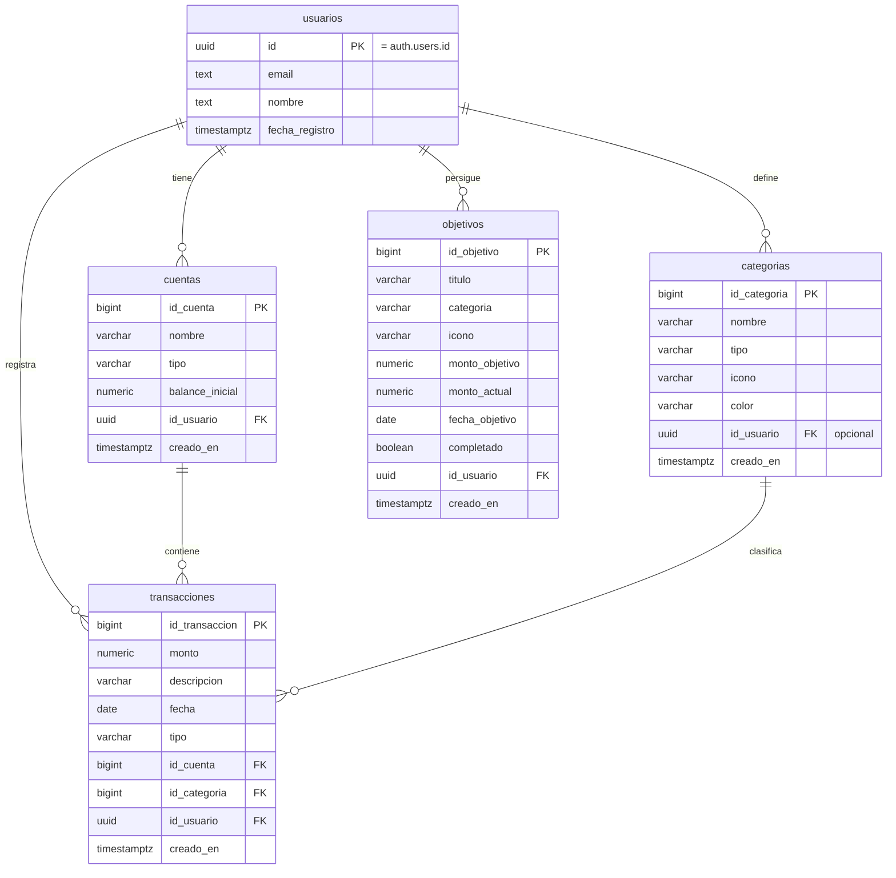
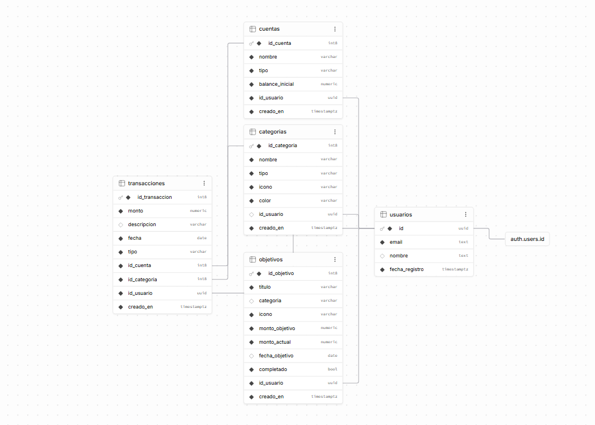

# Tracki — Finanzas personales

Aplicación web para llevar el control de ingresos, gastos y objetivos de ahorro. Cada usuario gestiona sus propias cuentas, registra movimientos por categoría y consulta la evolución de su dinero en un panel de estadísticas.

**Demo:** [tracki-seven.vercel.app](https://tracki-seven.vercel.app) · Proyecto académico del CFGS de Desarrollo de Aplicaciones Multiplataforma (DAM).

---

## Funcionalidades

- **Registro e inicio de sesión** con Supabase Auth (email y contraseña).
- **Cuentas:** varias cuentas por usuario (nombre, tipo y saldo inicial).
- **Transacciones:** ingresos y gastos asociados a una cuenta y una categoría.
- **Objetivos de ahorro:** importe objetivo, progreso acumulado, fecha límite opcional y estado completado.
- **Estadísticas:** evolución del balance, gasto por categoría y comparativa por mes (Recharts).
- **Filtro global por cuenta:** el selector de cuenta afecta a todo el dashboard (Context API).

## Stack

| Capa | Tecnología |
|---|---|
| Frontend | Next.js 16 (App Router), React 19, TypeScript |
| Estilos y animación | Tailwind CSS 4, Framer Motion |
| Gráficos | Recharts |
| Backend | Supabase: Auth + PostgreSQL |
| Despliegue | Vercel |

## Modelo de datos

Cinco tablas en PostgreSQL. La tabla `usuarios` extiende `auth.users` de Supabase y el resto de tablas cuelgan de ella mediante `id_usuario`.



<details>
<summary>Diagrama exportado desde Supabase</summary>



</details>

## Seguridad

- **Row Level Security (RLS)** en Supabase: la autorización se aplica en la base de datos. Las consultas del cliente no filtran por usuario, sino que es PostgreSQL quien solo devuelve las filas cuyo `id_usuario` coincide con el usuario autenticado. Por eso es seguro exponer la `anon key` en el cliente.
- **Alta de usuarios:** al registrarse, un trigger (`handle_new_user`) copia el nuevo usuario de `auth.users` a la tabla pública `usuarios`, junto con el nombre enviado como metadato en `signUp`.
- **`proxy.ts`:** redirige a `/login` a quien entra en `/dashboard` sin sesión. Es una mejora de experiencia de usuario, no una barrera de seguridad, porque se basa en una cookie del cliente. La protección real de los datos es RLS.

## Estructura

```
app/
  page.tsx              Landing
  login/, registro/     Autenticación
  dashboard/            Resumen, cuentas, transacciones, objetivos, estadísticas
components/             Modales, navegación, selector de cuenta…
contexts/               AccountFilterContext (filtro global), ModalContext
lib/supabase.ts         Cliente de Supabase compartido
proxy.ts                Redirección de rutas del dashboard sin sesión
```

## Ejecutar en local

Requisitos: Node.js 20+ y un proyecto de Supabase con el modelo de datos anterior.

```bash
git clone https://github.com/rubengiliramirez/tracki.git
cd tracki
npm install
```

Crea un archivo `.env.local` en la raíz:

```
NEXT_PUBLIC_SUPABASE_URL=https://<tu-proyecto>.supabase.co
NEXT_PUBLIC_SUPABASE_ANON_KEY=<tu-anon-key>
```

```bash
npm run dev
```

Abre [http://localhost:3000](http://localhost:3000).

## Próximos pasos

- Versionar el esquema, las políticas RLS y el trigger en el repositorio (`supabase/migrations`) para poder recrear la base de datos desde cero.
- Comprobar la sesión en el servidor con `@supabase/ssr` en lugar de con una cookie del cliente.
- Añadir tests de los cálculos de balance y progreso de objetivos.

## Autores

Proyecto desarrollado en pareja por **Rubén Gili Ramírez** y **[NOMBRE DE TU COMPAÑERO]**. No repartimos módulos: diseñamos, programamos y revisamos juntos cada parte de la aplicación.
